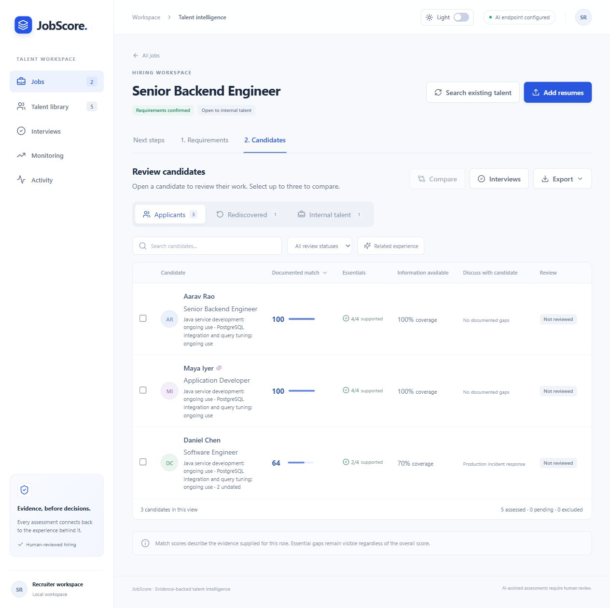
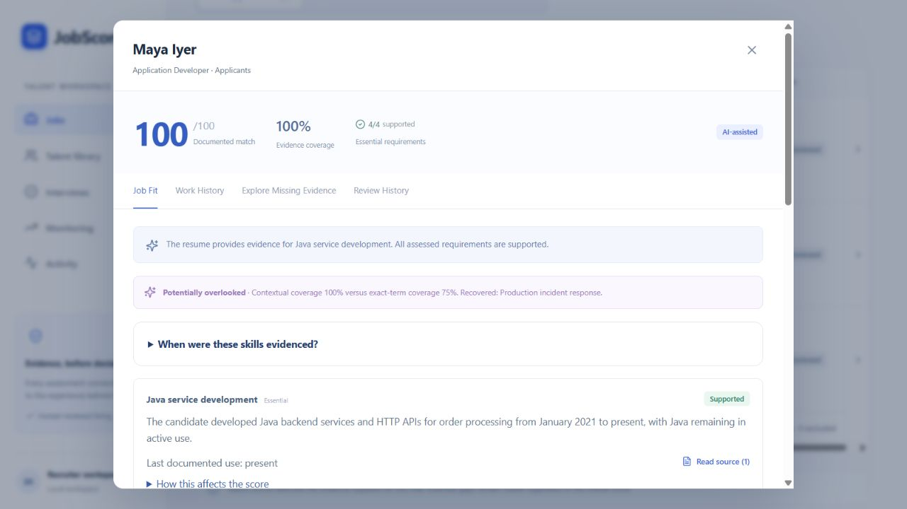
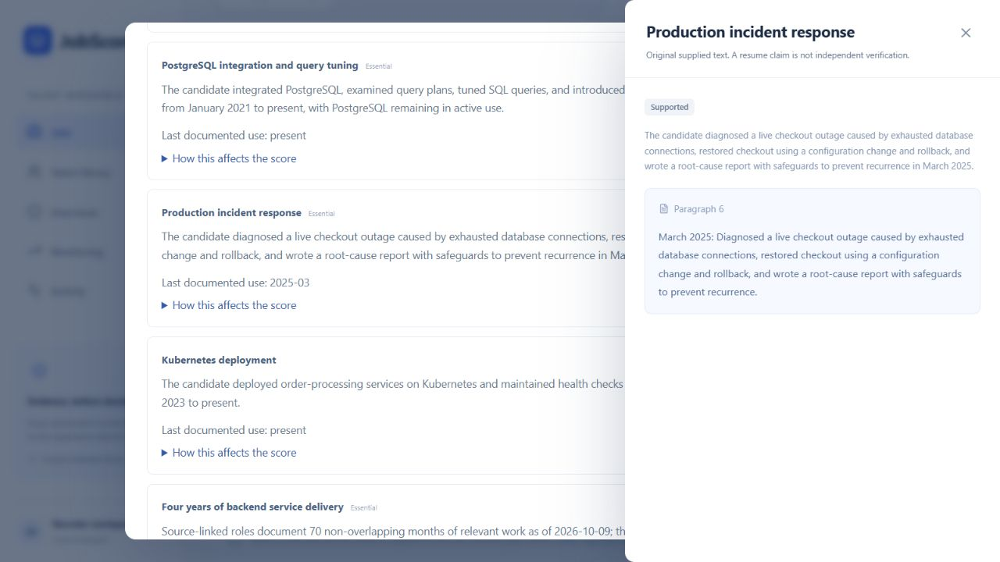
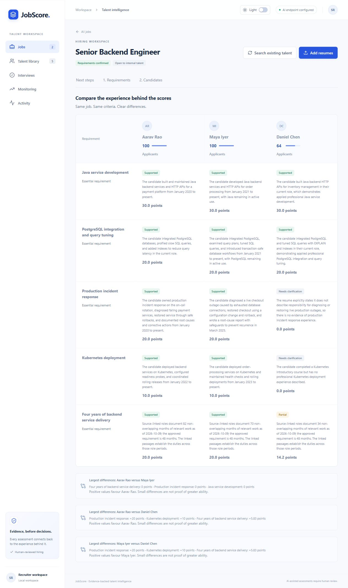
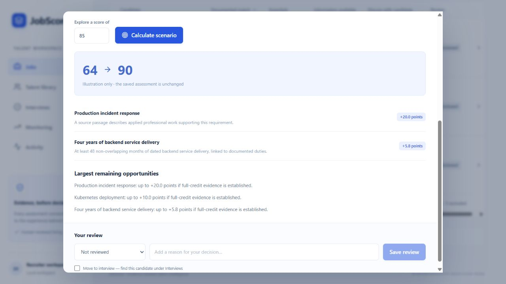
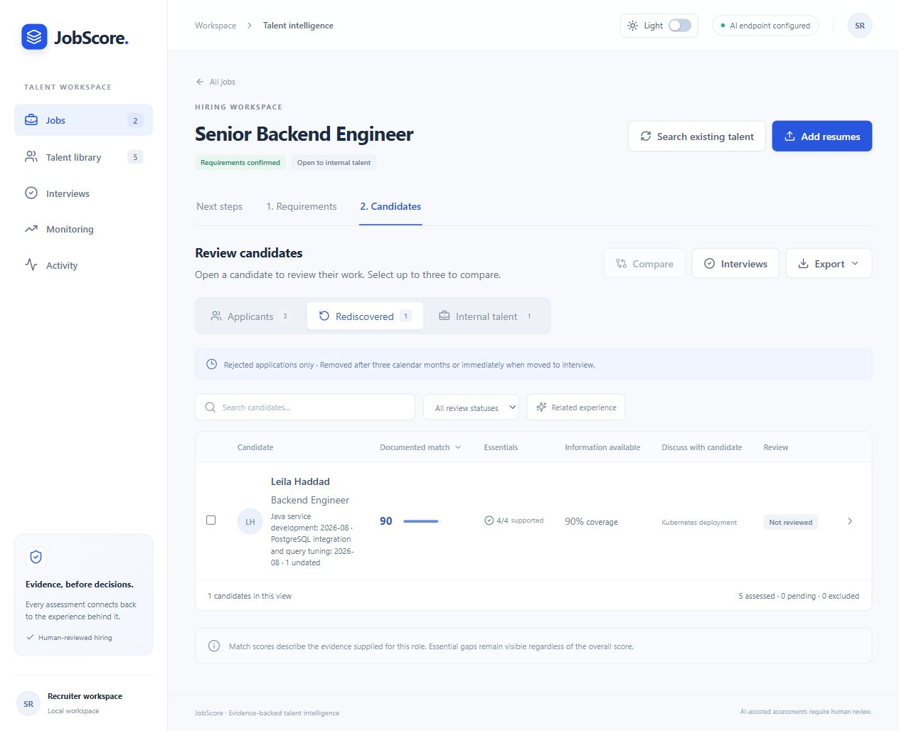
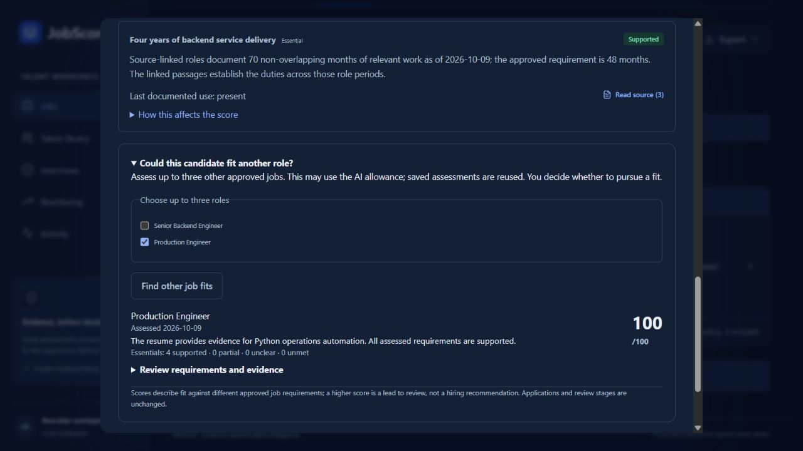

# JobScore demonstration

These screenshots were captured from the running application in **AI mode on 9 October 2026**. Every candidate, employer and resume in this demonstration is fictional. Job descriptions were extracted by the configured model, then the requirements and weights were reviewed before approval. The screenshots show the application's saved results; they are not mockups.

For a short presentation, start with contextual matching, open the source passage, compare the candidates, and finish with another-role exploration. This shows why the explanation matters as much as the score.

## A complete recruiter workspace

Three applicants, one eligible past applicant and one opted-in employee have been assessed for Senior Backend Engineer. The workspace keeps documented match, essential requirements and information availability separate. Daniel's unresolved incident-response evidence remains visible alongside his score.

## Relevant work beyond exact keywords

Maya's title is Application Developer. Her resume describes diagnosing a checkout outage, restoring service and documenting prevention measures, without using the phrase “incident response.” The approved requirement receives supported credit through that evidence. Contextual skill coverage is **100%**, compared with **75%** exact-term coverage, so the profile is flagged for closer review.

## Follow a finding back to the document

The evidence drawer shows the original passage and its paragraph location next to the requirement. Here, the recruiter can read the outage example that supports Maya's incident-response finding. A source link establishes traceability; the recruiter still decides whether the claim is convincing.

## Explain the differences between candidates

Aarav, Maya and Daniel are compared against the same approved rubric. The table shows the finding, explanation and point contribution for every requirement, followed by all three pairwise comparisons. Daniel's **34 months** of documented backend delivery receive proportional credit against the **48-month** requirement. Python calculates those months from source-linked role dates and merges overlapping periods.

## Turn a score gap into a conversation

Daniel's saved score is **64**. For a target of **85**, the simulator identifies a hypothetical combination of fully supported incident-response evidence and the remaining experience requirement, reaching **90**. These are questions to investigate, not points awarded for promises or an automatic recommendation. The saved assessment remains **64**; this was checked through the API after the scenario ran.

## Revisit eligible past applicants

Leila appears under Rediscovered with a documented match of **90**. Her source record describes an earlier final interview for a different job and a recent rejection. The search applies matching permission, retention and the three-calendar-month rediscovery window. Current applicants remain in their own tab until a recruiter explicitly changes their application status.

## Explore another role for internal talent

Nisha, an opted-in Platform Engineer, scores **70** for Senior Backend Engineer, where Java evidence needs clarification. An explicitly requested assessment against the approved Production Engineer role scores **100**, with four supported essentials. The recruiter can inspect that role's requirements and evidence before deciding what to pursue. Exploring a role does not transfer the application or change the review stage. This screenshot also shows the working dark theme.

## Capture and validation notes

- Model: `nvidia/nemotron-3-ultra-550b-a55b`; interpretation method: `jobscore-2.4-role-duration`.
- Final primary-job state: five eligible, five assessed, zero pending and zero failed; the additional role assessment also completed.
- Live run, including assessment refreshes: 20 reported model calls and 38,890 provider-reported tokens. This demonstrates a working integration, not a general accuracy benchmark.
- Source references were checked for all five final assessments; comparison returned all three pairs and the scenario preserved the saved result.
- The backend regression suite passed 125 tests. Two bugs found during this run—model month arithmetic and local-midnight rejection eligibility—were corrected before the final captures. Details are in [CHANGELOG.md](docs/CHANGELOG.md).
- Captures used an isolated local database. The repository and submission archive contain the seven JPEGs and documentation, with no API key, uploaded resumes or demo database.

The images can be used directly in the repository or a presentation. All seven together occupy less than 650 KB. Use the contextual-matching and source-evidence pair when space is limited.
